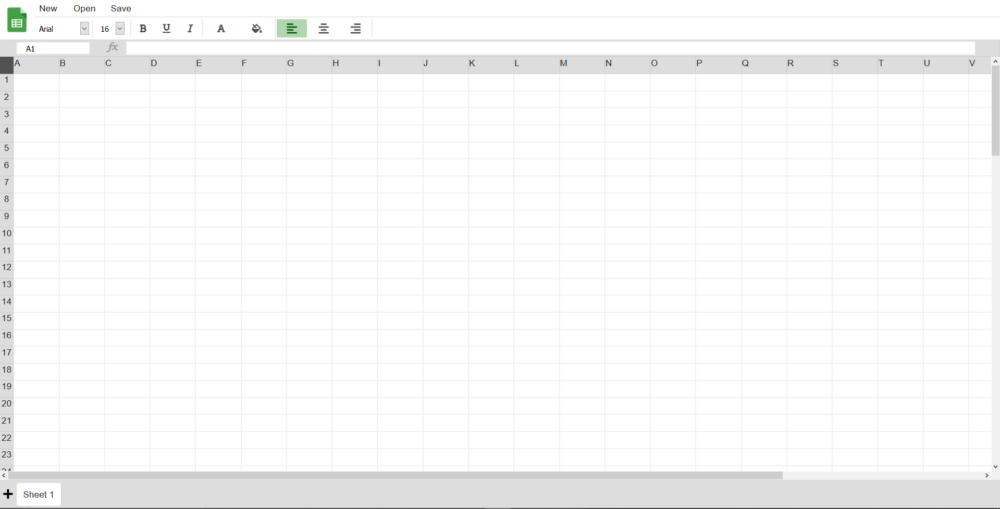
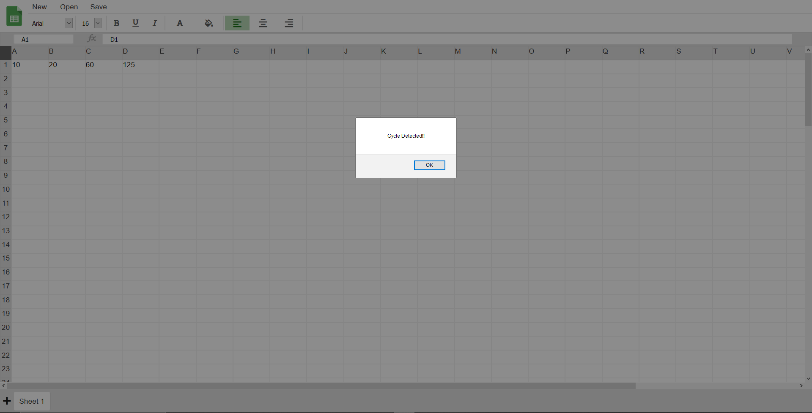
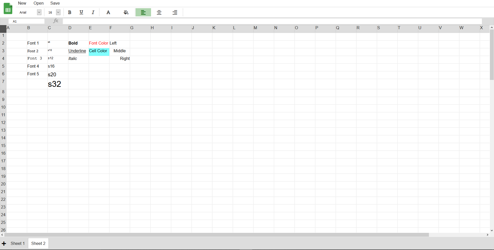

<h1 align="center">
  Google Sheets Clone
</h1>

# Description:

### Sheets clone is built using technologies such as HTML CSS and Javascript.
### Some features of this project are -
- Change Cell size
- Cycle Detection(if any)
- Evaluate Formula using Stack;
- New, Open, Save functionality
- Formatting - font, size, bold, italic, underline, color, background color, position.
- Adding Multiple sheets

# 🚀 Technical Stack:

## Frontend:
- Programming Language: Javascript
- IDE: VScode

### Screenshots
 

## Related Links:
Project Video Link: https://www.linkedin.com/posts/falansh-siddh_html-css-javascript-activity-6801895147249377280-1bh6  
Live Link: https://fsiddh.github.io/Google-Sheets-Clone/

###### Email: falansh.rs@gmail.com

### Thank you!

  
  &nbsp;&nbsp;&nbsp;&nbsp;
  

